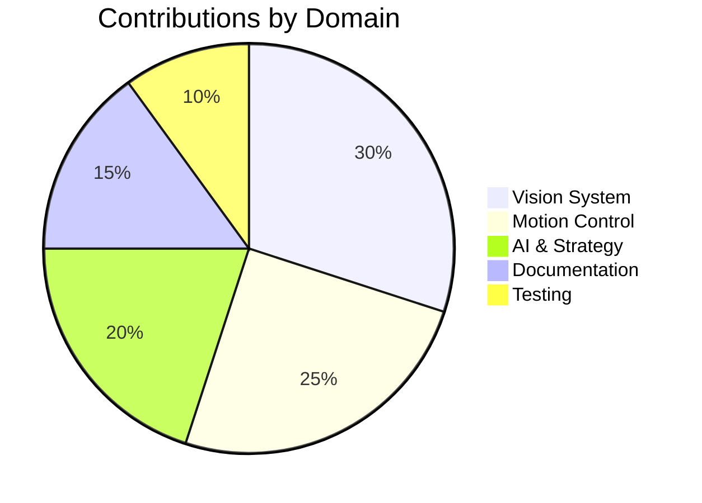

## 🌟 Core Team Members

### 👑 Project Leaders

<table>
  <tr>
    <td align="center">
      <a href="https://github.com/saeidtafazzol">
        
         
        <b>Saeid Tafazzol</b>
      </a>
       
      Project Lead
    </td>
    <td align="center">
      <a href="https://github.com/arashrahmani">
        
         
        <b>Arash Rahmani</b>
      </a>
       
      Technical Lead
    </td>
  </tr>
</table>

### 🚀 Core Developers

<table>
  <tr>
    <td align="center">
      <a href="https://github.com/AmiirGholamii">
        
         
        <b>Amir Gholami</b>
      </a>
       
      Vision System
    </td>
    <td align="center">
      <a href="https://github.com/Awrsha">
        
         
        <b>Amir M. Parvizi</b>
      </a>
       
      Motion Control
    </td>
    <td align="center">
      <a href="https://github.com/mahdizynali">
        
         
        <b>Mahdi Zynali</b>
      </a>
       
      AI & Strategy
    </td>
  </tr>
</table>

## 🛠️ Domain Experts

### 🤖 Robotics Team
<table>
  <tr>
    <td align="center">
      <a href="https://github.com/iw4p">
        
         
        <b>Nima Akbarzadeh</b>
      </a>
       
      Robotics Expert
    </td>
    <td align="center">
      <a href="https://github.com/ArshiaPazoki">
        
         
        <b>Arshia Pazoki</b>
      </a>
       
      Control Systems
    </td>
  </tr>
</table>

### 👁️ Computer Vision Team
<table>
  <tr>
    <td align="center">
      <a href="https://github.com/taherfattahi">
        
         
        <b>Taher Fattahi</b>
      </a>
       
      CV Expert
    </td>
    <td align="center">
      <a href="https://github.com/hamta-niknazar">
        
         
        <b>Hamta Niknazar</b>
      </a>
       
      Image Processing
    </td>
  </tr>
</table>

## 📊 Contribution Statistics

## 🏆 Hall of Fame

### Major Contributors
| Name | Contributions | Domain | Period |
|------|--------------|---------|---------|
| Saeid Tafazzol | 🌟 Core Architecture | System Design |  |
| Arash Rahmani | 🛠️ Technical Implementation | Development |  |
| Amir Gholami | 👁️ Vision System | Computer Vision |  |
| Amir M. Parvizi | 🤖 Motion Control | Robotics |  |

### Special Thanks
- Professor Dr. Babak Karasfi for guidance and supervision
- The RoboCup Technical Committee
- Islamic Azad University, Qazvin Branch

## 🤝 How to Contribute

We welcome contributions from everyone! Here's how you can help:

1. 🍴 Fork the repository
2. 🌿 Create a feature branch (`git checkout -b feature/AmazingFeature`)
3. 💻 Commit your changes (`git commit -m 'Add some AmazingFeature'`)
4. 📤 Push to the branch (`git push origin feature/AmazingFeature`)
5. 🔄 Open a Pull Request

### Contribution Guidelines
- Write clear, commented code
- Follow our coding standards
- Include tests for new features
- Update documentation as needed
