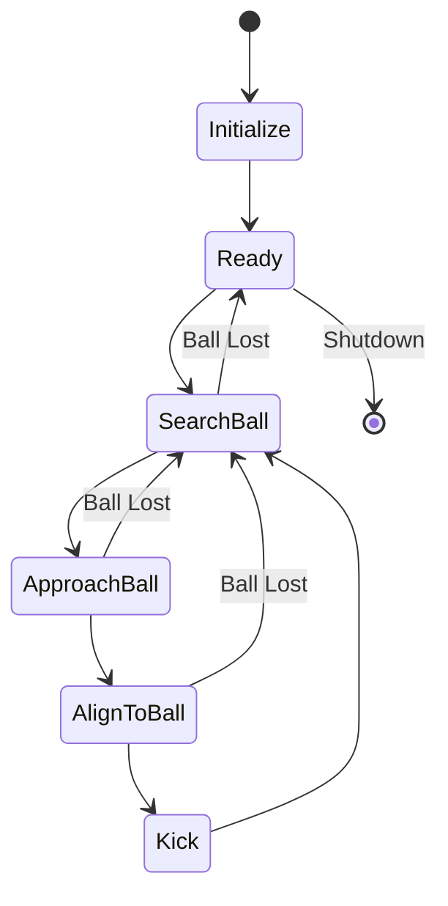
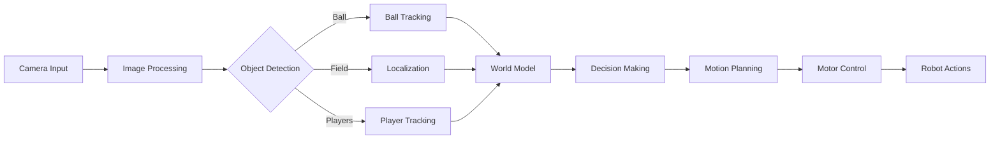
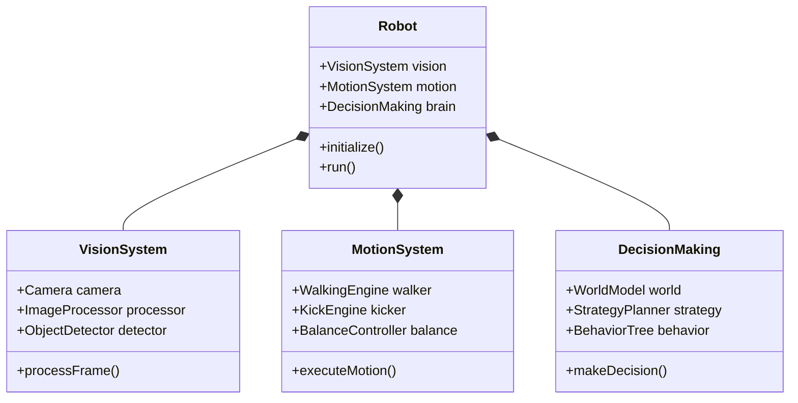

  
  # MRL-HSL Humanoid Soccer Robot Projects
  
  
  
  
  
  
  

  ### 🤖 Humanoid Soccer Robot | Karen 🤖

---

## 🛠️ Technologies & Tools

---

## 📖 Description

The MRL project, initiated in 2003 at the Mechatronics Research Laboratory (Islamic Azad University, Qazvin branch), stands at the forefront of robotics research and education. With a distinguished history in RoboCup competitions, our team has consistently pushed the boundaries of humanoid robotics.

### 🤖 About the Humanoid League

> Experience the pinnacle of robotics where autonomous humanoid robots compete in soccer matches using human-like perception and movement. Our robots navigate complex challenges including dynamic walking, running, ball manipulation, visual perception, self-localization, and team coordination - all without simplified sensor systems.

### 🏛️ About Mechatronic Research Laboratory (MRL)

> Since 2003, MRL has evolved from a single laboratory to a comprehensive research center comprising 11 specialized labs. Our facility stands as a national scientific research pole, distinguished by its cutting-edge equipment, expert researchers, and numerous international accolades.

---

## 📊 Project Architecture & Workflows

### State Machine Workflow

### Data Flow

### Component Hierarchy

## 🌟 Key Features

- 🤖 Advanced Humanoid Robot Control
- 🧠 Deep Learning Integration
- 👀 Computer Vision Systems
- 🎮 Real-time Control Systems
- 🌐 Simulation Environments
- 📊 Data Analysis Tools

---

## 💻 Development Team

|  |  |  |
|:---:|:---:|:---:|
| [Saeid Tafazzol](https://github.com/saeidtafazzol) | [Arash Rahmani](https://github.com/arashrahmani) | [Amir Gholami](https://github.com/AmiirGholamii) |

|  |  |  |
|:---:|:---:|:---:|
| [Amir M. Parvizi](https://github.com/Awrsha) | [Mahdi Zynali](https://github.com/mahdizynali) | [Hamta Niknazar](https://github.com/hamta-niknazar) |

[View all contributors →](./CONTRIBUTORS.md)

---

## 📫 Contact & Support

---

  
### 💙 Support the Project
If you find this project useful, please consider giving it a ⭐️

